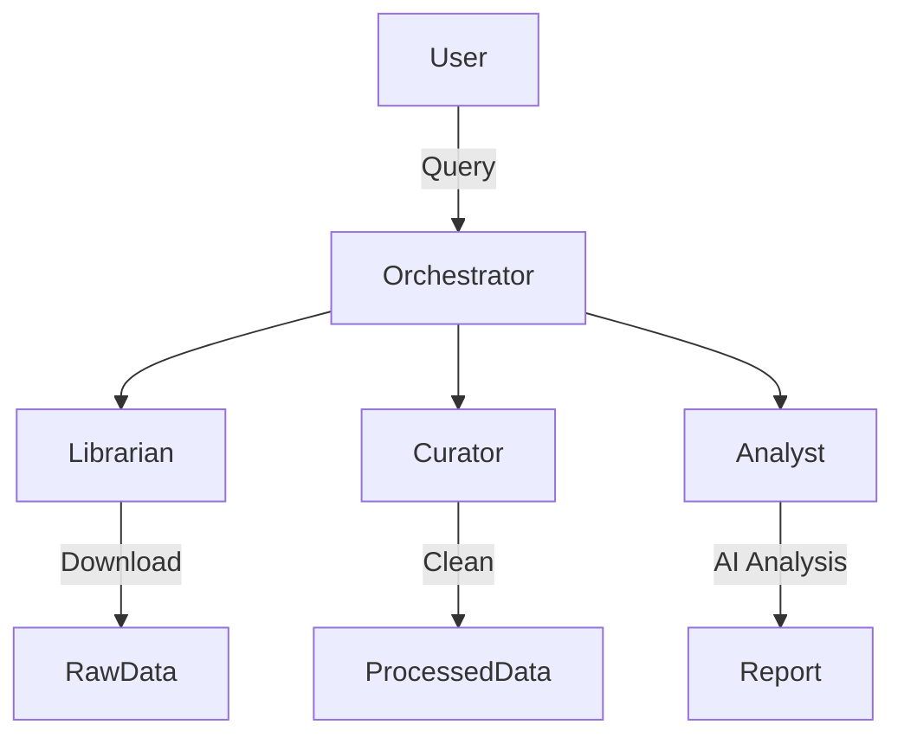

graph TD
    user([User Input]) -->|Query| main[Orchestrator (main.py)]
    
    subgraph "Phase 1: Retrieval"
        main -->|Trigger| librarian[Agent A: The Librarian]
        librarian -->|Search NCBI| ncbi[(NCBI Database)]
        ncbi -->|FASTA Files| raw[./data/raw]
    end
    
    subgraph "Phase 2: QC"
        main -->|Trigger| curator[Agent B: The Curator]
        curator -->|Validate| raw
        raw -->|Filter| processed[./data/processed]
        raw -->|Reject| logs[./data/logs]
    end
    
    subgraph "Phase 3: Analysis"
        main -->|Trigger| analyst[Agent C: The Analyst]
        analyst -->|Read Sequence| processed
        analyst -->|Ask Context| gemini(Google Gemini AI)
        gemini -->|Bio-Insight| analyst
    end
    
    analyst -->|Generate| report([analysis_report.md])
    
    style main fill:#f9f,stroke:#333,stroke-width:2px
    style gemini fill:#bbf,stroke:#333,stroke-width:2px
    style ncbi fill:#bfb,stroke:#333,stroke-width:2px

    # Autonomous Multi-Agent Bioinformatics Pipeline

  

## Overview
This project is an autonomous agentic pipeline designed to automate standard bioinformatics workflows. Instead of manually searching databases, filtering sequences, and reading literature, this system deploys three specialized AI Agents:

1.  **The Librarian:** Interfaces with NCBI Entrez to retrieve nucleotide data.
2.  **The Curator:** Performs Quality Control (QC) on raw sequences (length/ambiguity checks).
3.  **The Analyst:** Uses **Google Gemini** to generate biological insights and compiles a markdown report.

## Architecture
The system follows a linear orchestration pattern managed by `main.py`.



Getting Started
Prerequisites
Docker Desktop installed

Google Gemini API Key

Installation & Setup
Clone the repository:
```bash
git clone [https://github.com/yourusername/bio-agent-pipeline.git]
cd bio-agent-pipeline
```
Configure Credentials: Create a .env file in the root directory:
```
GOOGLE_API_KEY=your_gemini_key_here
NCBI_EMAIL=your_email@example.com
```
Build the Docker image:
```bash
docker compose build

Run the pipeline: Execute the orchestration script via Docker:
```bash
docker compose exec bio-pipeline python main.py --query "INS[Gene] AND Homo sapiens[Organism] AND RefSeq"
```

├── data/               # Persistent data storage (mounted volume)
│   ├── raw/            # Downloads from Agent A
│   ├── processed/      # Cleaned files from Agent B
│   └── logs/           # QC rejection logs
├── src/
│   ├── agents/         # Logic for individual agents
│   │   ├── librarian.py
│   │   ├── curator.py
│   │   └── analyst.py
│   └── utils/          # Config and helper scripts
├── Dockerfile          # Container definition
├── docker-compose.yml  # Volume and Env management
└── main.py             # Orchestrator entry point


## Technical Architecture & Design Decisions

### Why Python?
Python is the industry standard for orchestration and API interaction in bioinformatics. It allows seamless integration between Biopython (for biological data parsing) and Google GenAI SDK (for reasoning).

### Performance Considerations
While Python is ideal for this logic-heavy pipeline, it is not suitable for high-performance computing tasks like de novo genome assembly.

- Current State: Python handles orchestration and light stats.

- Future Scope: Computationally heavy alignment tasks would be offloaded to a compiled language like Rust or C++, wrapped by this Python orchestrator.

### Example Output
The pipeline generates an ```analysis_report.md``` containing:

- Sequence Statistics (GC Content, Length)

- AI-Generated Biological Context (Function, Clinical Significance)